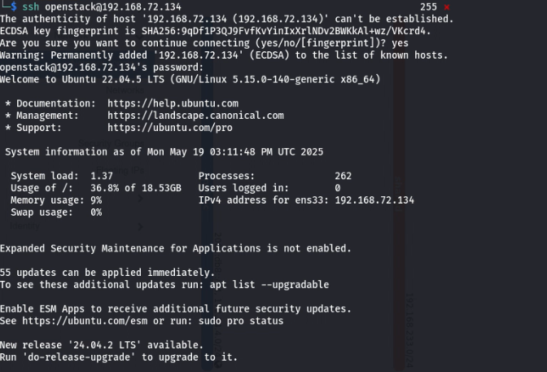
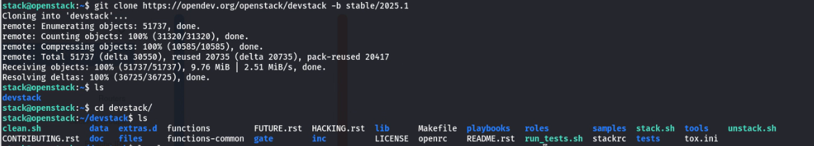
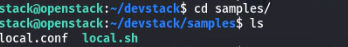
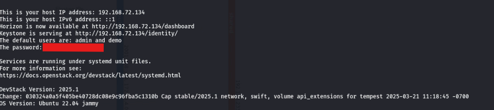

# Secure Authentication Strategies in Private Cloud Infrastructure

## DevStack Installation for OpenStack

DevStack is a set of extensible scripts designed to quickly deploy a complete OpenStack environment using the latest versions from git master. It is primarily used as a development environment and for OpenStack's functional testing.

---

### Quick Start Guide

#### 1. Install Linux

Start with a clean, minimal install of a supported Linux system. DevStack supports:
- **Ubuntu 22.04 (Jammy)** is recommended as it is the most tested and generally the smoothest to use.
 
---

#### 2. Add Stack User (Optional but Recommended)

DevStack should be run as a **non-root user with sudo privileges**. 

If not using a cloud image, create a dedicated `stack` user with a home directory, ensure the directory has executable permissions for all users, and grant the user passwordless sudo access.

Switch to the `stack` user before proceeding.

---

#### 3. Download DevStack

Clone the DevStack repository and navigate into it.

---

#### 4. Create `local.conf`

Create a `local.conf` file at the root of the DevStack repository with a minimal configuration including preset passwords for ADMIN, DATABASE, RABBIT, and SERVICE. Use only alphanumeric characters in passwords to avoid service issues.

A sample `local.conf` file is available in the `samples` directory of the repository.

---

#### 5. Start the Installation

Run the installation script `stack.sh`. The installation typically takes 15 to 30 minutes depending on your internet speed, as many git repositories and packages are downloaded and installed.

---

### Reference

For detailed instructions and additional configuration options, please consult the official OpenStack documentation:  

[**Devstack Installation Tutorial for Ubuntu**](hhttps://opendev.org/openstack/devstack)  

---
### After Installation

Once OpenStack is successfully deployed using DevStack, you need to set up [**Keystone-RBA-Plugin**](Keystone.md) and [**Horizon-RBA-Plugin**](Horizon.md)
