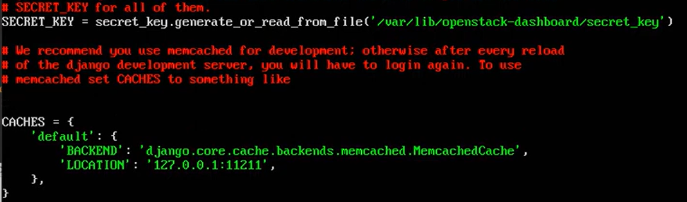
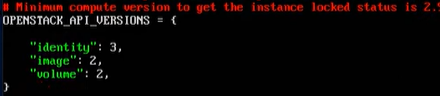

# **OpenStack Horizon Installation Guide**

This document provides a high-level overview of installing and configuring the OpenStack Dashboard, Horizon, on an Ubuntu system. For comprehensive, step-by-step instructions, please refer to the official OpenStack documentation.

## Prerequisites

Before proceeding, ensure that:

- You have administrative access to the Ubuntu system.
- The system is updated and has access to the necessary repositories.
- The Identity service (Keystone) is properly installed and configured.
- The Apache HTTP server and Memcached service are installed and running.

## Installation Steps

1. **Install Horizon Package:** Use the package manager to install Horizon and its dependencies.

2. **Configure Horizon:**

    - Edit the `/etc/openstack-dashboard/local_settings.py` file to set the `OPENSTACK_HOST` to point to your controller node:
    
    - Configure `ALLOWED_HOSTS` to include the hostnames or IP addresses that can access the dashboard:
    
    - Set up session storage using Memcached by configuring the `SESSION_ENGINE` and `CACHES` settings.
     
    - Enable the Identity API version 3 by setting `OPENSTACK_KEYSTONE_URL`.
    - Enable support for domains and configure API versions as needed:
     
    - Optionally, configure the time zone by setting the `TIME_ZONE` variable.

3. **Finalize Installation:**

    - Restart the Apache service to apply the changes:

      ```bash
      sudo service apache2 restart
      ```

  

## Reference

For detailed instructions and additional configuration options, please consult the official OpenStack documentation:

[**Horizon Installation Tutorial for Ubuntu**](https://docs.openstack.org/horizon/latest/install/install-ubuntu.html)
