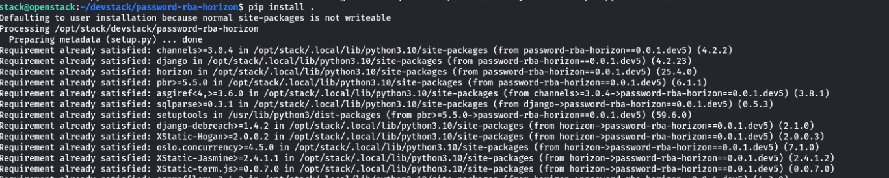
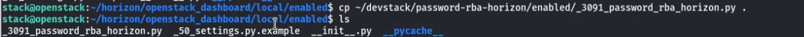
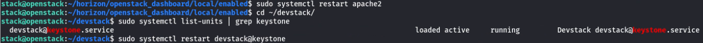
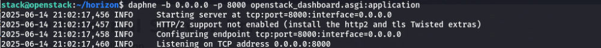
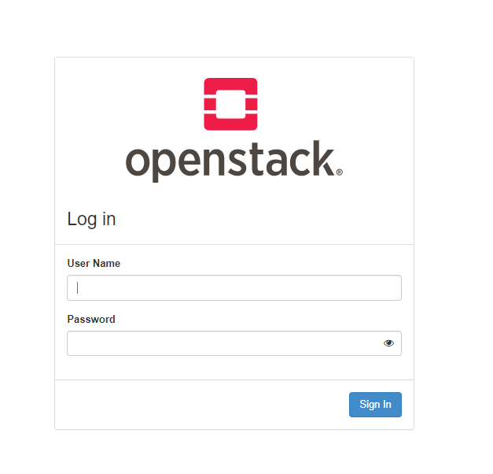

# **Integration of Horizon RBA Plugin**


## **Overview**  
This document provides a high-level overview of installing and configuring  **Horizon RBA Plugin**  

---

## **Prerequisites**  

Before proceeding, ensure that: 
- Install the Keystoneauth Fork

    Before installing the RBA plugin, you must replace the standard Keystoneauth library with a fork that includes the RBA method. To do this, clone the custom Keystoneauth repository and install it:
    

    ```bash
    git clone https://github.com/das-group/keystoneauth.git
    cd keystoneauth
    pip install -r requriments.txt
    pip install .
    ``` 

    

## Installation Steps

### Step 1: Clone and Install the Plugin:


```bash
git https://github.com/das-group/password-rba-horizon.git
cd keystone-rba-plugin
pip install -r requriments.txt
pip install .
```




### Enable the Plugin in Horizon

1. Copy the plugin configuration file:

   ```bash
   cp enabled/_3091_password_rba_horizon.py horizon/openstack_dashboard/local/enabled/
    ```

    

2. Restart the Horizon web server to activate the plugin:

    ```bash 
    sudo systemctl restart apache2  # or your configured WSGI server
    ```

    

### Enabling RTT Feature (Optional)

To enable Round-Trip-Time (RTT) measurement via WebSockets:

1. **Install the Daphne web server**:

   ```bash
   sudo pip intall daphne
    ```

2. **Place `sgi.py`next to Horizon’s `wsgi.py`**:

    `
    horizon/openstack_dashboard/asgi.py
    `
3. **Update `settings.py` with ASGI support**:

    ```python
    ASGI_APPLICATION = 'openstack_dashboard.asgi.application'
    ```

 4. **Enable Cached Sessions Instead of Cookie-Only Sessions**:

    Update the Horizon `settings.py` file with the following configuration:

    ```python
    SESSION_ENGINE = 'django.contrib.sessions.backends.cache'

    CACHES = {
        'default': {
            'BACKEND': 'django.core.cache.backends.memcached.MemcachedCache',
            'LOCATION': 'controller:11211',
        },
    }
    ```
5. **Start the Asynchronous Web Server**:

    Run the Daphne server to enable WebSocket support:

    ```bash
    daphne -b 0.0.0.0 -p 8000 openstack_dashboard.asgi:application
    ```

    

     


## Reference

For detailed instructions and additional configuration options, please consult the following GItHub repository:  

[**Integration of Horizon RBA Plugin in Openstack**](https://github.com/das-group/keystone-rba-plugin/tree/main) 
