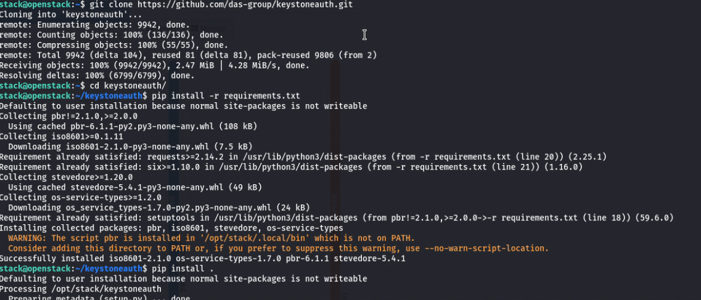
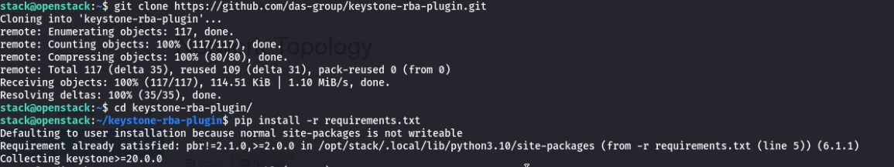
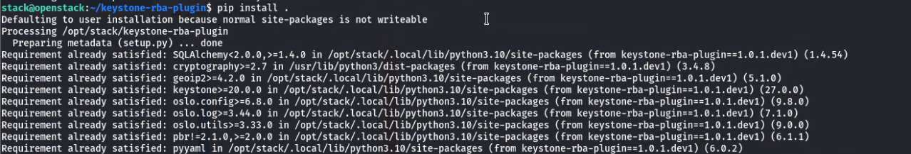
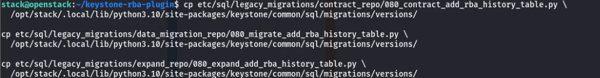
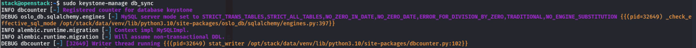
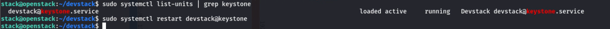

# **Integration of Keystone RBA Plugin**


## **Overview**  
This document provides a high-level overview of installing and configuring  **Keystone RBA Plugin**  

---

## **Prerequisites**  

Before proceeding, ensure that: 
- Install the Keystoneauth Fork

    Before installing the RBA plugin, you must replace the standard Keystoneauth library with a fork that includes the RBA method. To do this, clone the custom Keystoneauth repository and install it:
    

    ```bash
    git clone https://github.com/das-group/keystoneauth.git
    cd keystoneauth
    pip install -r requriments.txt
    pip install .
    ``` 

    

---

## **Installation Steps**  

### Step 1: Clone and Install the Plugin

```bash
git clone https://github.com/das-group/keystone-rba-plugin.git
cd keystone-rba-plugin
pip install -r requriments.txt
pip install .
```





### Step 2: Database Migration

The RBA plugin adds a new table to track authentication history. Follow these steps to apply the necessary database changes:

1. **Locate the migration files** in the plugin repository:

   - `etc/sql/legacy_migrations/contract_repo/080_contract_add_rba_history_table.py`
   - `etc/sql/legacy_migrations/data_migration_repo/080_migrate_add_rba_history_table.py`
   - `etc/sql/legacy_migrations/expand_repo/080_expand_add_rba_history_table.py`

2. **Copy each file** to the corresponding Keystone migration directories:

   - Move to: `keystone/common/sql/legacy_migrations/contract_repo/versions/`
   - Move to: `keystone/common/sql/legacy_migrations/data_migration_repo/versions/`
   - Move to: `keystone/common/sql/legacy_migrations/expand_repo/versions/`

        

3. **Check for conflicting version numbers** in those directories.  
   If `080_*.py` already exists, update the number (e.g., `081_`) to the next available unused version.

4. **Apply the migration** 

Run database migrations:

   ```bash
   sudo keystone-manage db_sync
   ```



### Step 3: Restart the Keysone

 Restart the Keystone service inside DevStack:

```bash
sudo systemctl restart devstack@keystone
```



## **Reference**  

For detailed instructions and additional configuration options, please consult the following GItHub repository:  

[**Integration of Keystone RBA Plugin in Openstack**](https://github.com/das-group/keystone-rba-plugin/tree/main) 