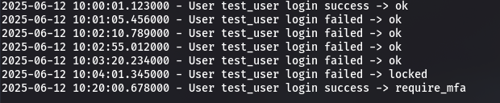
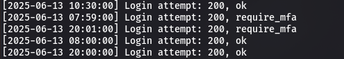

# Security Testing Analysis

## Test Location

All unit tests for the Keystone RBA plugin rules are maintained in:

```
keystone_rba_plugin/tests/unit/
```

This organization follows OpenStack’s standard test directory structure and facilitates integration into the broader test framework.

---

## Failed Login Rate Rule Test

### Description

Tests for the `FailedLoginRateRule` validate that the system correctly:

- Parses Keystone authentication logs for login attempts (username, timestamp, success/failure).
- Tracks failed login attempts and locks accounts exceeding the configured threshold within the time window.
- Correctly evaluates login attempts during lockout and after lock expiry.
- Focuses on a designated test user (`test_user`) for targeted validation.

### Running Test

Use one of the following commands:

```bash
tox -e py38 -- keystone_rba_plugin/tests/unit/test_failed_login_rate_rule.py
```
or 

```bash
python -m unittest keystone_rba_plugin.tests.unit.test_failed_login_rate_rule
```

### Test Result

Picture described below shows the result of this testing:

 

---

## Time-Based MFA Rule Tests

### Description

Tests for the `TimeBasedMFARule` ensure the rule correctly:

- Extracts login timestamps for a specified user from Keystone logs.
- Determines if each login occurred outside configured working hours.
- Flags login attempts outside working hours as requiring MFA (`require_mfa`), while allowing others (`ok`).
- Prints detailed status for each login event during testing.

### Running Tests

Run the tests using either of the following commands:

```bash
tox -e py38 -- keystone_rba_plugin/tests/unit/test_time_based_mfa_rule.py
```

or

```bash
python -m unittest keystone_rba_plugin.tests.unit.test_time_based_mfa_rule
```

### Test Result

Picture described below shows the result of this testing:

 

---
## Requirements for Both Tests

- Access to Keystone logs, generally located at:

```
/opt/stack/logs/keystone.log
```

- Modify the log file path in the test code if it differs in your environment.


